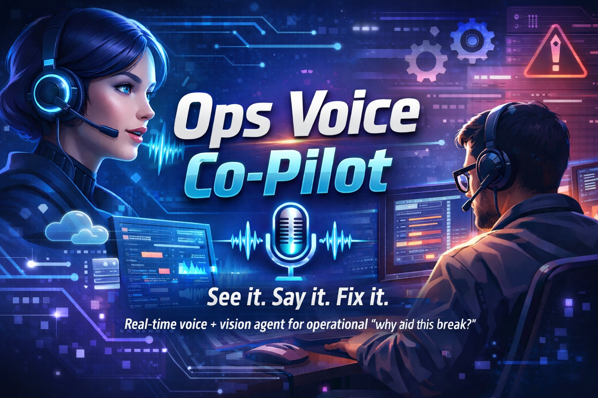

# Ops Voice Co-Pilot

[](LICENSE)
[](https://cloud.google.com/run)
[](https://ai.google.dev/)
[](https://cloud.google.com/vertex-ai)



**See it. Say it. Fix it.**

Real-time voice + vision agent for operational triage. Ask out loud “why did this break?” while sharing a dashboard or log screen—get grounded answers you can trust, without typing.

## What it does

- **Voice**: Real-time, interruptible conversation via Gemini Live API (Vertex AI). Speak into the mic; the co-pilot responds by voice. You can interrupt at any time.
- **Vision**: Upload or paste a screenshot of a dashboard (Grafana, GCP Console, Datadog) or log view. The agent grounds answers in what it sees.
- **Grounding**: Answers reference the screen and, when used, **Cloud Logging** — the Agent calls the Tools service (`get_recent_logs`) and says things like "From the logs I just pulled…".
- **GCP**: All three services run on **Cloud Run**; **Vertex AI** (Gemini Live API) and **Cloud Logging** (Tools service). Optional: Secret Manager for credentials.

## Architecture (microservices)

| Service   | Port | Role |
|-----------|------|------|
| **Gateway** | 8080 | Serves UI at `/`, `/health`; proxies WebSocket `/ws/live/voice` → Agent. |
| **Agent**   | 8081 | Gemini Live API; WebSocket `/ws/live/voice`; calls Tools service for `get_recent_logs`. |
| **Tools**   | 8082 | `POST /logs/recent` (Cloud Logging); used by Agent. |

Same codebase; each service is started with `SERVICE_NAME=gateway|agent|tools` (see `scripts/run-service.sh`). Diagram: [docs/ARCHITECTURE.md](docs/ARCHITECTURE.md).

## Quick start (local)

1. **Clone and enter the project**
   ```bash
   cd OpsVoiceCoPilot
   ```

2. **Create a virtualenv and install dependencies**
   ```bash
   python3 -m venv .venv
   source .venv/bin/activate   # Windows: .venv\Scripts\activate
   pip install -r requirements.txt
   ```

3. **Configure environment**
   - Copy `.env.example` to `.env`.
   - Set `GOOGLE_CLOUD_PROJECT` to your GCP project ID.
   - Use a service account with **Vertex AI User** and **Logs Viewer**. For local dev, `gcloud auth application-default login` is enough if your user has these roles.

4. **Run the app (choose one)**

   **Option A — Docker Compose (recommended)**  
   ```bash
   export GOOGLE_CLOUD_PROJECT=your-project-id   # or set in .env
   docker compose up --build
   ```
   Open http://localhost:8080

   **Option B — Three terminals**
   ```bash
   # Terminal 1 – Tools
   uvicorn services.tools.main:app --host 0.0.0.0 --port 8082

   # Terminal 2 – Agent
   TOOLS_SERVICE_URL=http://localhost:8082 uvicorn services.agent.main:app --host 0.0.0.0 --port 8081

   # Terminal 3 – Gateway
   AGENT_SERVICE_URL=http://localhost:8081 uvicorn services.gateway.main:app --host 0.0.0.0 --port 8080
   ```
   Open http://localhost:8080

5. **Use the UI**
   - Upload or paste a screenshot (dashboard / error / logs).
   - Click **Connect (Voice)**, then **Start mic**.
   - Optionally click **Send image to co-pilot** so the agent has the screenshot.
   - Ask out loud: "Why did this break?" or "What's this spike?" — answers are grounded in the image and, when relevant, in recent Cloud Logging entries.

## Deploy to Google Cloud

### Option A: Terraform with GCS backend (recommended)

Deploy with Terraform and store state in a **GCS bucket** for repeatable, shared state.

1. **Create the state bucket (one-time)**  
   ```bash
   ./scripts/terraform-bootstrap.sh YOUR_PROJECT_ID
   ```

2. **Configure and apply**  
   ```bash
   cd terraform
   cp terraform.tfvars.example terraform.tfvars
   # Edit terraform.tfvars: set project_id
   terraform init -backend-config="bucket=YOUR_PROJECT_ID-tfstate" -backend-config="prefix=ops-voice-copilot"
   terraform plan
   terraform apply
   ```

3. **Open the app**  
   Use the `gateway_url` output in the browser. **Public access is on by default** (`allow_unauthenticated = true`), so anyone can open the UI and test without signing in.

   If the UI or Connect (Voice) prompt for login, run once:  
   `./scripts/allow-public-access.sh YOUR_PROJECT_ID europe-west1`

Full steps, backend options, and re-deploy: [docs/DEPLOYMENT.md](docs/DEPLOYMENT.md).

### Demo and sample data

- **Sample transcript:** On first load the UI shows a sample Q&A (“Why did this break?” and a Co-pilot answer grounded in logs). Use **Load sample demo** in the Voice section to refill it anytime.
- **Seed logs in GCP:** To give the voice agent real log entries to cite, run once before a demo:
  ```bash
  ./scripts/push-demo-logs.py YOUR_PROJECT_ID
  ```
  See [docs/DEPLOYMENT.md](docs/DEPLOYMENT.md#demo-push-failure-logs-to-gcp).

### Option B: Shell script (quick deploy)

The script deploys **three** Cloud Run services (Tools → Agent → Gateway) and wires their URLs.

1. **Set project and region**
   ```bash
   export PROJECT_ID=your-gcp-project-id
   export REGION=europe-west1
   ```

2. **Deploy**
   ```bash
   ./scripts/deploy-cloudrun.sh $PROJECT_ID $REGION
   ```
   This deploys `ops-voice-copilot-tools`, `ops-voice-copilot-agent`, and `ops-voice-copilot` (Gateway). The script prints the Gateway URL at the end. Deployments are **public by default** so you can open the UI and test without signing in. To allow public access after a deploy that didn’t: `./scripts/allow-public-access.sh $PROJECT_ID $REGION`.

3. **IAM**  
   Grant the **Agent** and **Tools** service accounts **Vertex AI User** and **Logs Viewer** in the project (Gateway does not need them):
   ```bash
   PROJECT_NUMBER=$(gcloud projects describe $PROJECT_ID --format='value(projectNumber)')
   for SVC in ops-voice-copilot-agent ops-voice-copilot-tools; do
     gcloud run services add-iam-policy-binding $SVC --region $REGION \
       --member="serviceAccount:${PROJECT_NUMBER}-compute@developer.gserviceaccount.com" \
       --role="roles/aiplatform.user"
     gcloud run services add-iam-policy-binding $SVC --region $REGION \
       --member="serviceAccount:${PROJECT_NUMBER}-compute@developer.gserviceaccount.com" \
       --role="roles/logging.viewer"
   done
   ```

## Repo layout

```
OpsVoiceCoPilot/
├── services/
│   ├── core/                   # Shared config + logging
│   ├── gateway/main.py         # Gateway: UI at `/`, `/health`, WS proxy → Agent
│   ├── agent/main.py           # Agent: `/health`, `/ws/live/voice`; Live session + Tools
│   └── tools/main.py           # Tools: `/health`, POST `/logs/recent`, POST `/logs/demo/seed`
├── ui/                         # Static frontend (HTML/CSS/JS); sample demo transcript
├── scripts/
│   ├── run-service.sh          # Run gateway|agent|tools by SERVICE_NAME (local)
│   ├── deploy-cloudrun.sh      # Deploy all three to Cloud Run (script)
│   ├── terraform-bootstrap.sh  # GCS state bucket + Terraform apply + build image
│   ├── build-image.sh          # Build and push single image to Artifact Registry
│   ├── allow-public-access.sh  # Grant allUsers invoker on Cloud Run
│   └── push-demo-logs.py       # Same, run directly with project venv
├── terraform/                  # Terraform (GCS backend, Cloud Run, IAM, Artifact Registry)
│   ├── main.tf                 # Foundation + Tools, Agent, Gateway modules
│   ├── variables.tf, outputs.tf, backend.tf
│   └── modules/cloud-run/, modules/foundation/
├── docs/
│   ├── ARCHITECTURE.md         # Diagrams, data flow, file roles
│   ├── DEPLOYMENT.md           # Terraform + script deploy, demo logs
├── docker-compose.yml
├── Dockerfile                  # Single image; SERVICE_NAME selects process
├── requirements.txt
└── .env.example
```