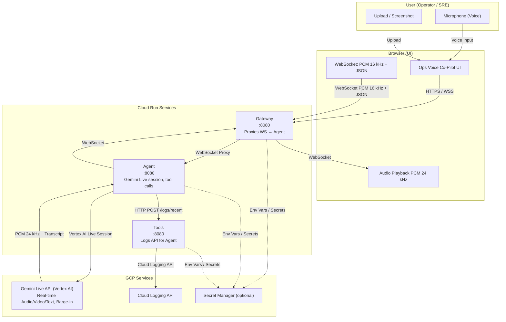

# Ops Voice Co-Pilot — Architecture

The app uses a **microservices architecture**: Gateway, Agent, and Tools. All three can run via Docker Compose locally or as separate Cloud Run services.


## High-level


## Services

```
                    ┌─────────────┐
                    │   Browser   │
                    │  (UI + WS)  │
                    └──────┬──────┘
                           │ :8080
                           ▼
┌──────────────────────────────────────────────────────────────────────────┐
│  Gateway (port 8080)                                                      │
│  • Serves / (static UI), /health                                          │
│  • WS /ws/live/voice → proxy to Agent (binary + text pass-through)        │
│  • Env: AGENT_SERVICE_URL                                                 │
└──────────────────────────────────────────────────────────────────────────┘
                           │
                           │ WS → Agent :8081 (local) or Agent URL (Cloud Run)
                           ▼
┌──────────────────────────────────────────────────────────────────────────┐
│  Agent (port 8081 local / 8080 Cloud Run)                                 │
│  • WS /ws/live/voice: Gemini Live session, audio/video/text queues       │
│  • On get_recent_logs: HTTP POST → Tools /logs/recent                      │
│  • Env: GOOGLE_CLOUD_PROJECT, VERTEX_AI_LOCATION, TOOLS_SERVICE_URL      │
└──────────────────────────────────────────────────────────────────────────┘
                           │
                           │ HTTP POST /logs/recent
                           ▼
┌──────────────────────────────────────────────────────────────────────────┐
│  Tools (port 8082 local / 8080 Cloud Run)                                  │
│  • POST /logs/recent { filter_expr?, page_size? } → Cloud Logging         │
│  • Returns { result: "..." } for agent grounding                           │
│  • Env: GOOGLE_CLOUD_PROJECT                                              │
└──────────────────────────────────────────────────────────────────────────┘
                           │
                           ▼
                    Cloud Logging API
```

## Data flow

1. **User** opens the app, optionally uploads/pastes a screenshot, clicks **Connect (Voice)** then **Start mic**.
2. **Browser** sends over WebSocket to **Gateway**:
   - **Binary**: PCM 16-bit 16 kHz mono (from mic).
   - **Text (JSON)**: `{"type": "image", "data": "<base64>", "mime_type": "image/jpeg"}` when user clicks "Send image to co-pilot".
3. **Gateway** proxies all WebSocket messages to **Agent**. Agent runs a Gemini Live session:
   - Pumps audio from queue into `session.send_realtime_input(audio=...)`.
   - Pumps image bytes from queue into `session.send_realtime_input(video=...)` (as JPEG frame).
   - System instruction: ops co-pilot persona, grounding, citations.
   - When the model calls **get_recent_logs**, the Agent calls **Tools** `POST /logs/recent`, then sends the result with `session.send_tool_response()`.
4. **Gemini** returns audio (PCM 24 kHz) and transcript events; Agent forwards them back through Gateway to the client.
5. **Browser** plays PCM 24 kHz and appends transcript lines. User can interrupt by speaking; Live API handles barge-in.

## GCP services used

| Service | Use |
|--------|-----|
| **Cloud Run** | Hosts Gateway, Agent, and Tools (three services). |
| **Vertex AI** | Gemini Live API (real-time voice + vision + tools). |
| **Cloud Logging** | Tools service lists recent log entries for grounding. |

Optional: **Secret Manager** for credentials (NFR-3: no hardcoded secrets).

## Mermaid diagram



## Security and secrets

- **Secrets**: Not hardcoded; use environment variables or Google Cloud Secret Manager. Cloud Run can inject env vars or mount secrets.
- **Auth**: Demo uses `--allow-unauthenticated` for judges; for production, add IAP or require auth for the WebSocket.

## File roles

| Component | File(s) | Role |
|-----------|---------|------|
| Entrypoint | `Dockerfile` (SERVICE_NAME) | Starts gateway, agent, or tools based on `SERVICE_NAME` via uvicorn. |
| Gateway | `services/gateway/main.py` | Serves UI at `/`, `/health`; proxies WebSocket to Agent. |
| Agent | `services/agent/main.py` | `/health`, `/ws/live/voice`; Live session; HTTP fetcher for Tools. |
| Tools | `services/tools/main.py` | `/health`, `POST /logs/recent`; calls `get_recent_logs_for_agent`. |
| Live session | `services/agent/live_session.py` | Gemini Live connect, ops system instruction, queues; `get_recent_logs_fetcher` calls Tools. |
| Logging tool | `services/tools/logging_tool.py` | Cloud Logging client; `get_recent_logs` / `get_recent_logs_for_agent`. |
| Config | `services/core/config.py` | `GOOGLE_CLOUD_PROJECT`, `VERTEX_AI_LOCATION`, `GEMINI_LIVE_MODEL`, `PORT`. |
| UI | `ui/index.html`, `ui/css/styles.css`, `ui/js/app.js` | Single-page: screenshot area, voice connect/mic, transcript. |
